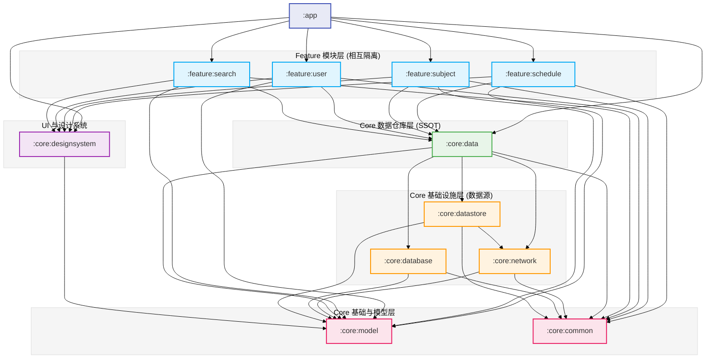
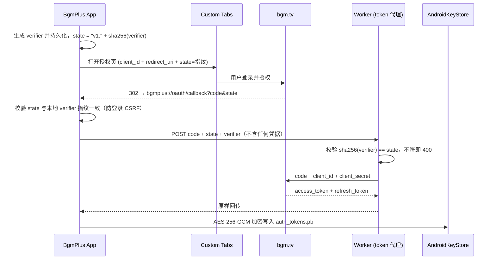

# BgmPlus

<div align="center">

**现代化 Bangumi (bgm.tv) 番组计划 Android 客户端**

基于 **Kotlin Multiplatform (KMP)** + **Jetpack Compose (Material 3 Expressive)** + **Now in Android (NiA)** 模块化整洁架构打造。

</div>

---

## 🏛️ 系统架构与模块依赖图 (Architecture & Dependency Graph)

本项目遵循严格的 **Unidirectional Data Flow (UDF)** 与 **Clean Architecture** 分层规范。模块间单向依赖，禁止 Feature 模块间直接依赖。



---

## 📦 模块索引与职责清单

| 模块名 | 模块类型 | 核心职责 | 详细说明 |
| :--- | :--- | :--- | :--- |
| [**:app**](app/README.md) | Android App | 应用主入口、Navigation 3 路由调度、全局 Koin DI 初始化、主界面 Shell | [查看 README](app/README.md) |
| [**:core:model**](core/model/README.md) | KMP Core | 纯 Kotlin 领域数据模型（Subject、Episode、AirSchedule、UserProfile 等） | [查看 README](core/model/README.md) |
| [**:core:common**](core/common/README.md) | KMP Core | 协程调度器、`AppResult<T>` 结果封装、通用工具类 | [查看 README](core/common/README.md) |
| [**:core:network**](core/network/README.md) | KMP Core | 基于 Ktor 3.x 的 Bangumi REST v0 API 客户端、bangumi-data CDN 解析器与 OAuth token 代理客户端 | [查看 README](core/network/README.md) |
| [**:core:database**](core/database/README.md) | KMP Core | 基于 Room 3.0 的本地 SQLite 持久化层（DAOs 与 Entities） | [查看 README](core/database/README.md) |
| [**:core:datastore**](core/datastore/README.md) | KMP Core | 强类型 `DataStore<UserPreferences>` 用户配置与登录态；OAuth Token 经 AndroidKeyStore AES-GCM 加密独立存储 | [查看 README](core/datastore/README.md) |
| [**:core:data**](core/data/README.md) | KMP Core | 单一可信源（SSOT）Repository 仓库实现，协调网络与本地缓存 | [查看 README](core/data/README.md) |
| [**:core:designsystem**](core/designsystem/README.md) | Android Library | Jetpack Compose Material 3 Expressive 主题、色彩、排版与原子 UI 组件 | [查看 README](core/designsystem/README.md) |
| **worker (独立服务)** | Cloudflare Worker | OAuth token 代理：服务端注入 `client_secret`，授权码兑换与 token 刷新的无状态转发（独立私有仓库维护，部署至 `bgmplus-auth.shadow2go.dpdns.org`） | - |

---

## 🔐 认证与安全架构 (Auth & Security)

Bangumi OAuth 要求在 token 端点提交 `client_secret` 且不支持 PKCE，因此本项目将兑换环节收口到专用的 **Cloudflare Worker 代理服务**（部署于 `bgmplus-auth.shadow2go.dpdns.org`）：`client_secret` 只存在于 Worker 的加密 secret 存储，APK 内仅有公开的 `client_id`。



**安全设计要点**：

- **凭据不进 APK**：`client_secret` 仅存于 Worker（`wrangler secret put`），已通过 dex 级二进制扫描验证；`client_id` 为 OAuth 公开标识，按设计随包分发。
- **Token 加密落盘**：AndroidKeyStore 硬件密钥 + AES-256-GCM，写入独立文件 `auth_tokens.pb`，与普通偏好隔离。
- **备份排除**：`dataExtractionRules`（Android 12+）与 `fullBackupContent` 双规则排除 token 文件；Keystore 密钥不可迁移，跨设备恢复的密文自动失效。
- **verifier 绑定（PKCE 等价）**：bgm.tv 无 PKCE，由 Worker 强制校验——state 携带 `sha256(verifier)` 公开指纹（兼做 CSRF 一次性比对），兑换须出示 verifier 原文；伪造回调过不了 state 比对，截获回调者缺 verifier 兑不了换，抵御登录 CSRF 与回调拦截两类攻击。
- **统一鉴权注入**：Ktor Auth 插件自动附加 Bearer 并在 401 时经 Worker 刷新重试；业务代码不接触 token。
- **日志纪律**：release 构建为 `LogLevel.NONE`；debug 为 `INFO`（仅请求生命周期，不含 header/body）。
- **构建加固**：release 启用 R8 minify + resource shrink。

**已知限制**：回调使用自定义 scheme（`bgmplus://`），scheme 抢注与回调拦截已由 verifier 绑定闭合（伪造被 state 比对拒绝、拦截兑换被 verifier 缺失拒绝）；残余风险为攻击者已 root 受害设备并注入进程的场景，属客户端防御边界之外，已评估接受。App Links（`assetlinks.json`）为可选增强——安全收益已被 verifier 覆盖，且依赖尚不存在的正式发布签名证书，暂不实施；若未来配置签名可顺路启用。`*.workers.dev` 域名在中国大陆不可达，代理固定走自定义域名。

---

## 🛠️ 技术栈 (Tech Stack)

* **语言**: Kotlin 2.4.x (K2 编译器) + Kotlin Multiplatform (KMP)
* **构建系统**: Gradle 9.x + Android Gradle Plugin 9.3.x + Android Settings Plugin + Version Catalog
* **UI 框架**: Jetpack Compose + Material 3 Expressive
* **网络引擎**: Ktor 3.5.x Client + `kotlinx.serialization` (JSON)
* **本地存储**: AndroidX Room 3.0.x + AndroidX Proto DataStore
* **凭据安全**: AndroidKeyStore (AES-256-GCM) 加密 DataStore + 备份排除规则
* **后端基础设施**: Cloudflare Worker（OAuth token 代理，无状态转发，独立仓库维护）
* **图片加载**: Coil 3.x (Ktor3 集成)
* **依赖注入**: Koin 4.2.x (`koin-android`, `koin-androidx-compose`, `koin-compose-navigation3`)
* **异步与流**: Kotlin Coroutines + Flow

---

## 🚀 构建与验证 (Build & Test)

```bash
# 1. 快速代码格式检查 (Spotless + ktlint)
./gradlew spotlessCheck

# 2. 自动格式化代码
./gradlew spotlessApply

# 3. 运行全工程单元测试 (KMP 聚合测试套件)
./gradlew allTests

# 4. 运行指定单模块单元测试 (以 :core:data 为例)
./gradlew :core:data:testAndroid

# 5. 编译 Debug APK
./gradlew assembleDebug

# 6. 编译 Release APK（R8 混淆 + 资源收缩）
./gradlew assembleRelease
```
