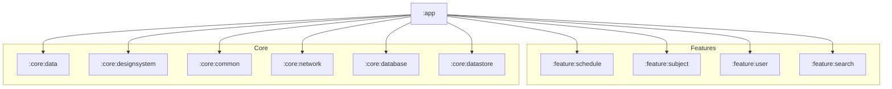

# Module `:app`

## 📖 模块概述
`:app` 是整个 BgmPlus 应用程序的入口模块。它负责聚合所有 `:feature:*` 业务功能模块与 `:core:*` 基础设施模块，装配全局依赖注入容器（Koin），并构建顶级应用容器与导航树。

---

## 🏛️ 依赖关系图 (Dependency Graph)

---

## 🔑 核心职责与关键类

1. **`BgmApplication`**：应用 Application 类，在 `onCreate()` 中初始化 Koin DI 模块（`appModule`, `networkModule`, `databaseModule`, `datastoreModule`, `dataModule`）。
2. **`MainActivity`**：主入口 Activity，支持 `enableEdgeToEdge()`，承载顶级 Compose 内容。
3. **全局导航调度**：基于 Navigation 3 / Type-Safe Routes 聚合所有 Feature 屏幕。
