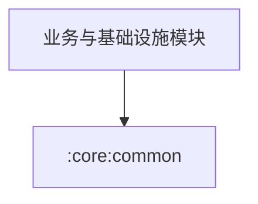

# Module `:core:common`

## 📖 模块概述
`:core:common` 提供全工程通用的纯 Kotlin 工具类、协程调度器注入模型、统一的错误与结果封装包装器。

---

## 🏛️ 依赖关系图 (Dependency Graph)

---

## 🔑 核心工具与类

* **`AppResult<T>`**：统一领域结果封装密封接口（`Success<T>`、`Error`、`Loading`），支持 `asResult()` 流变换。
* **`BgmDispatchers` / `Dispatcher`**：标准协程调度器注解与注入接口（`IO`、`Default`、`Main`）。
* **`TimeUtils`**：跨平台日期时间转换工具。
