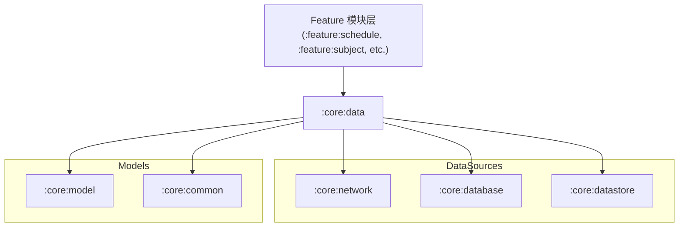

# Module `:core:data`

## 📖 模块概述
`:core:data` 是全应用的 **单一可信源（Single Source of Truth, SSOT）** 仓库层。它协调来自 `:core:network` 的远程数据、`:core:database` 的本地缓存与 `:core:datastore` 的配置数据，向上游 Feature 模块与 ViewModel 提供干净的响应式数据流。

---

## 🏛️ 依赖关系图 (Dependency Graph)



---

## 🔑 核心 Repositories

* **`AuthRepository`**：登录编排。`beginLogin()` 生成 SecureRandom state 并持久化、返回授权 URL；`completeLogin()` 校验 state → 经 Worker 兑换 token → 加密落盘；`logout()` 清理 token 与登录态（保留普通偏好）。
* **`ScheduleRepository`**：放送时刻表仓库，协调 bangumi-data CDN 与本地 Room 缓存，提供离线放送列表与自动同步。
* **`SubjectRepository`**：条目详情仓库，提供番剧详情、单集列表、角色信息与收藏更新。
* **`UserCollectionRepository`**（规划中）：用户追番进度与收藏列表同步仓库。

## 🧪 测试

`androidUnitTest` 源集下的 `AuthRepositoryImplTest` 使用 Ktor `MockEngine` 驱动真实 `BgmTokenService`，覆盖 state 校验、兑换成功/失败、登出清理等全部分支：

```bash
./gradlew :core:data:testDebugUnitTest
```
