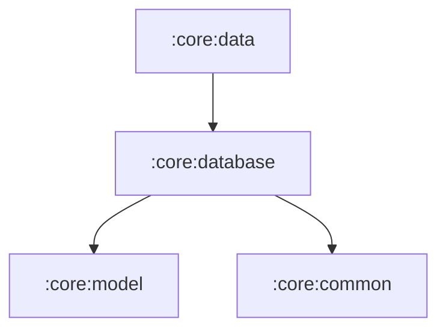

# Module `:core:database`

## 📖 模块概述
`:core:database` 负责本地结构化数据的 SQLite 持久化存储。基于 **AndroidX Room 3.0** 构建，为全应用提供离线缓存、离线浏览与响应式数据流（`Flow<T>`）支持。

---

## 🏛️ 依赖关系图 (Dependency Graph)

---

## 🔑 核心组件与 DAOs

* **`BgmDatabase`**：Room 数据库核心类，包含版本迁移与表注册。
* **`AirScheduleDao`**：每日放送时刻表缓存 DAO（支持按星期查询、清除与批量插入）。
* **`SubjectDao`**：番剧/条目详情本地缓存 DAO。
* **`EpisodeDao`**：剧集/单集信息本地缓存 DAO。
* **`UserCollectionDao`**：用户本地追番与收藏进度 DAO。
* **`DatabaseModule`**（`androidMain`）：基于 Koin 的数据库单例注入。
