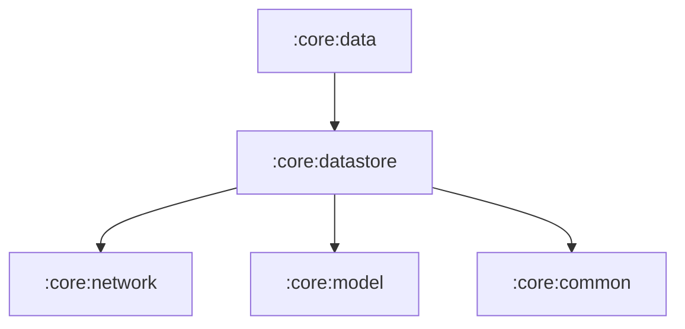

# Module `:core:datastore`

## 📖 模块概述
`:core:datastore` 负责两类持久化：**普通用户偏好**（强类型 `DataStore<UserPreferences>`）与 **OAuth Token 的加密存储**（AndroidKeyStore AES-GCM + 独立 DataStore 文件）。二者物理隔离，后者被备份规则整体排除。

---

## 🏛️ 依赖关系图 (Dependency Graph)

> 对 `:core:network` 的依赖仅为 `TokenProvider` 接口（`KeystoreTokenProvider` 是其落盘实现），方向仍是无环的。

---

## 🔑 核心组件与数据结构

* **`UserPreferences`**：普通偏好的 `@Serializable` 实体（用户资料、`isLoggedIn`、`pendingOAuthState`、暗黑模式、通知分钟数）。**不含任何 token**。
* **`UserPreferencesDataSource`**：暴露 `userPreferences: Flow<UserPreferences>` 与 `markLoggedIn()`、`clearAuth()`、`setPendingOAuthState()`、`setDarkMode()` 等原子更新。
* **`CryptoManager`**（`androidMain`）：AndroidKeyStore 硬件密钥 + AES-256-GCM；密钥不可导出、不随备份迁移，密文格式为 `IV(12B) || ciphertext+tag`。
* **`AuthTokensDataSource`**（`androidMain`）：token 独立加密存储，文件 `auth_tokens.pb` 内容为 `Base64(IV || 密文)`；解密失败按"未登录"降级，避免崩溃循环。
* **`KeystoreTokenProvider`**（`androidMain`）：`:core:network` 中 `TokenProvider` 接口的落盘实现，由 `DatastoreModule` 绑定为全局单例。

## 🔐 安全设计

* Token 与普通偏好物理隔离，便于 `dataExtractionRules` / `fullBackupContent` 整体排除备份；
* Keystore 密钥不可迁移 → 被恢复到其他设备的密文无法解密，自动失效；
* `pendingOAuthState` 为非敏感的 CSRF 随机值，随普通偏好持久化以对抗浏览器往返期间的进程回收。
