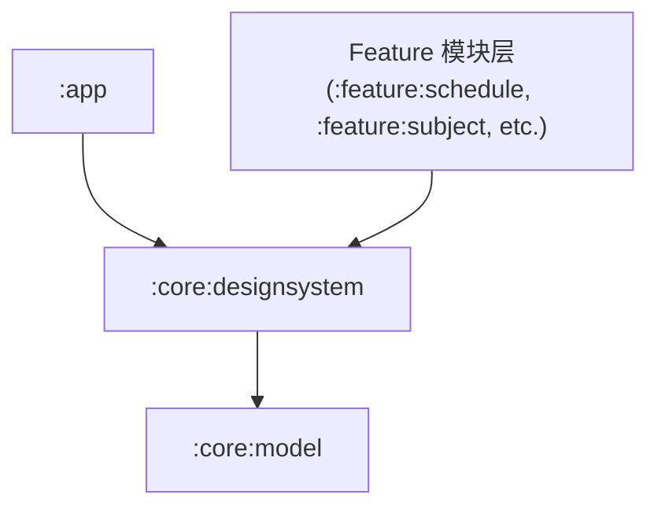

# Module `:core:designsystem`

## 📖 模块概述
`:core:designsystem` 是应用的 UI 基础设计系统。基于 **Jetpack Compose** 与 **Material 3 Expressive** 构建，包含全套主题色彩、排版 Token、常用动效以及可复用的基础 UI 组件。

---

## 🏛️ 依赖关系图 (Dependency Graph)

---

## 🔑 核心组件与设计资产

* **`BgmPlusTheme`**：应用顶级主题，支持 Android 12+ 动态取色（Dynamic Color）、浅色/深色主题自适应。
* **`Color` / `Type`**：统一的 Material 3 Expressive 调色板与排版定义。
* **`CoverImage`**：基于 Coil 3.x 封装的高性能条目封面组件，内置占位符、渐变遮罩与圆角裁剪。
* **`LoadingState` / `ErrorState`**：通用的加载中骨架屏与重试错误面板。
