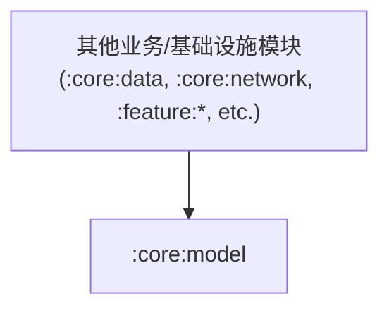

# Module `:core:model`

## 📖 模块概述
`:core:model` 是纯 Kotlin 领域数据模型层（Kotlin Multiplatform）。本模块保持 **0 外部系统依赖**（不依赖任何 Android SDK、Ktor 或 UI 框架），仅包含领域业务模型与强类型枚举。

---

## 🏛️ 依赖关系图 (Dependency Graph)

---

## 🔑 核心数据模型

* **`Subject` / `SubjectType`**：番剧/条目核心模型（包含名称、评分、封面、类型等）。
* **`Episode` / `EpisodeType`**：剧集/单集信息模型。
* **`AirSchedule` / `AirSite`**：放送时刻表、站点播放源模型。
* **`UserProfile` / `UserCollection` / `CollectionType`**：用户资料与追番收藏状态。
