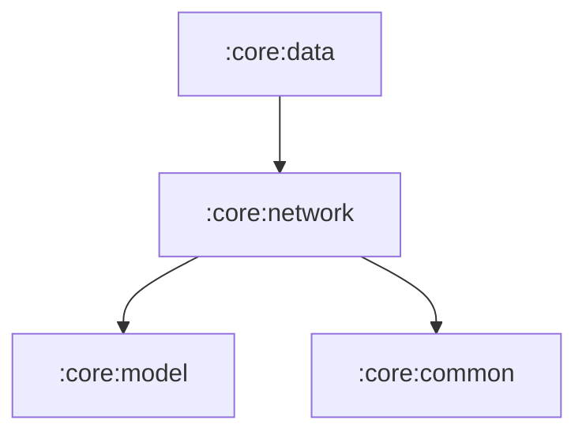

# Module `:core:network`

## 📖 模块概述
`:core:network` 负责处理所有网络数据交互，基于 **Ktor 3.x 客户端** 与 `kotlinx.serialization` 构建：官方 Bangumi REST v0 API、bangumi-data CDN 数据，以及 **经 Cloudflare Worker 代理的 OAuth token 兑换与刷新**。

---

## 🏛️ 依赖关系图 (Dependency Graph)

---

## 🔑 核心组件与服务

* **`BgmHttpClient`**：Ktor 客户端工厂。统一注入 `User-Agent: BgmPlus/1.0.0 (android)`、Content-Negotiation (JSON)、超时与状态码到 `BgmNetworkException` 的映射。两种形态：
  * **业务 client**（默认）：安装 Auth 插件，自动附加 Bearer 并在 401 时经刷新回调重试；
  * **token client**（`tokenRefresher = null`）：无 Auth 插件，专供 `BgmTokenService`，避免刷新请求自身 401 递归。
  * 日志由调用方按构建类型传入：release `LogLevel.NONE`，debug `INFO`（仅请求生命周期，不含 header/body）。
* **`BgmAuthConfig`**：OAuth 公开配置（client_id、redirect_uri、Worker 代理地址）与授权 URL 构造。**不持有任何 secret**。
* **`BgmTokenService`**：经 Worker 代理完成 `authorization_code` 兑换与 `refresh_token` 刷新；请求体不携带任何凭据（Worker 端注入并强制覆盖）。
* **`TokenProvider`**：token 读写接口（SSOT 入口），生产实现在 `:core:datastore` 的 `KeystoreTokenProvider`。
* **`BangumiApiService`**：Bangumi v0 REST API（放送表、条目详情、剧集列表、收藏状态更新等）。Authorization 由 Auth 插件统一注入，业务方法不接触 token。
* **`BangumiDataService`**：从 CDN 抓取并解析 `bangumi-data` 开源放送数据库。

## 📝 约定

* 所有对 `api.bgm.tv` / `bgm.tv` 的请求必须经由本模块的 client 发出，以保证 User-Agent 合规；
* 禁止绕过 `TokenProvider` 直接读写 token，禁止在业务方法签名中传递 accessToken。
